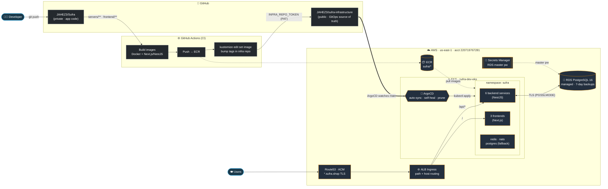
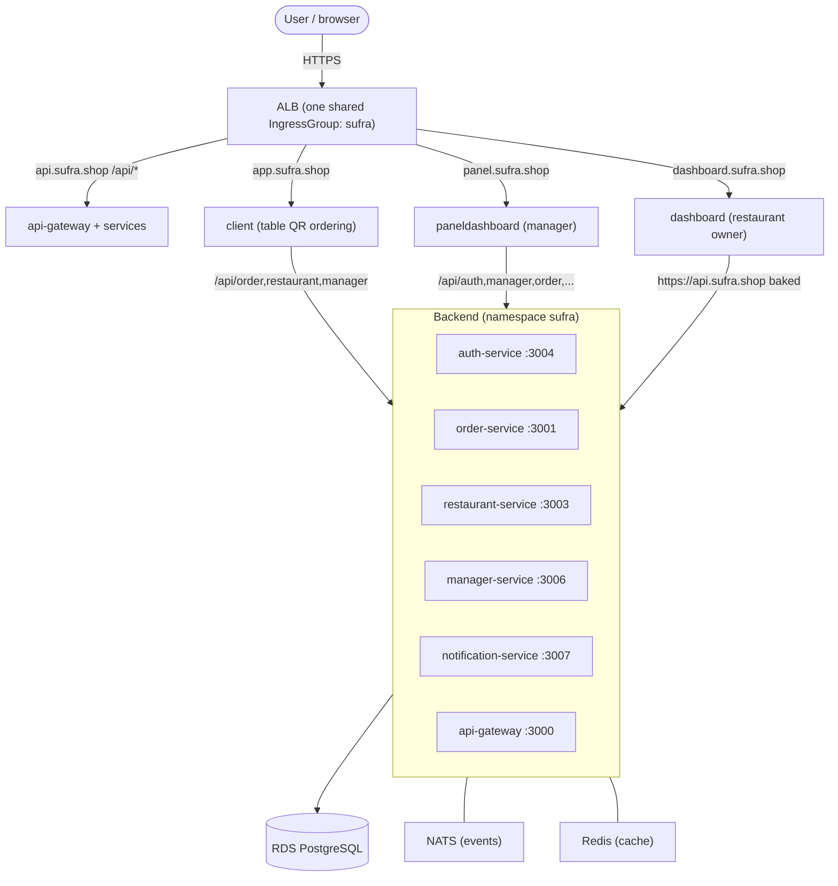

# Sufra — DevOps Architecture

End-to-end GitOps pipeline: a single `git push` ships code to production on AWS
EKS, with no manual deploy step.

> View rendered: VS Code Markdown preview (`Ctrl+Shift+V`) or on GitHub.

## CI/CD → GitOps flow



## Runtime request routing



## Tool stack

| Layer | Tools |
|-------|-------|
| Source | GitHub (2 repos: private app + public GitOps) |
| CI | GitHub Actions · Docker Buildx · OIDC → AWS |
| Registry | Amazon ECR |
| CD (GitOps) | ArgoCD · Kustomize |
| Orchestration | Amazon EKS (Kubernetes 1.30) |
| Data | RDS PostgreSQL · ElastiCache (provisioned) · in-cluster NATS/Redis |
| Networking | AWS Load Balancer Controller (ALB) · Route53 · ACM (TLS) |
| Secrets | AWS Secrets Manager · k8s Secrets (IRSA for S3) |
| IaC | Terraform (bootstrap: state + OIDC) |

## The one-push promise

```
git push  →  GitHub Actions builds & pushes to ECR  →  bumps image tag in the
public infra repo  →  ArgoCD detects the change on main  →  syncs to EKS  →
rolling update live.  No kubectl, no manual deploy.
```
